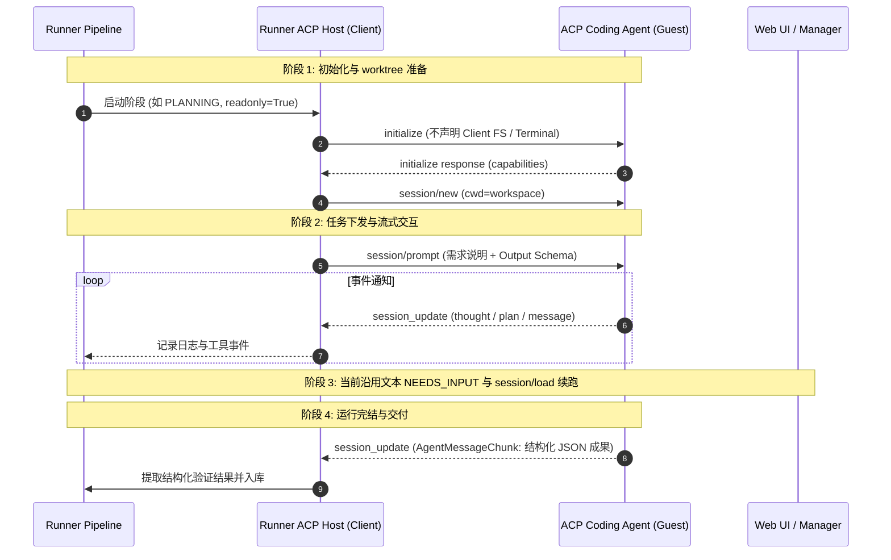

# 平台与 Agent 交互协议演进：走向 Agent Client Protocol (ACP)

本文档系统性论述 `agent-task-mvp` 平台与 Coding Agent 交互协议的演进方向，重点分析由 Zed、JetBrains 等发起的 **Agent Client Protocol (ACP)** 标准，并结合本地已下载的 Pi Agent 源码与官方 ACP Python SDK，给出平台的落地架构方案。

---

## 一、为什么与 Agent 的交互必须走向协议化？

在早期的原型与 MVP 实现中，调度系统往往采用粗暴的“命令行执行”模式：

```
Runner  ──(启动子进程)──>  codex / claude / agy -p "需求说明"  ──(管道重定向)──>  stdout/stderr
```

这种模式在面对生产级多阶段编排、长上下文治理与人机交互时暴露出致命缺陷：

| 痛点维度 | 命令行模式 (CLI `-p` + stdout 抓取) | 原生协议模式 (ACP / RPC) |
| :--- | :--- | :--- |
| **可观测性** | 依靠解析终端 ANSI 文本输出，容易被进度条、格式化混淆 | 结构化事件流（`tool_call`, `message_update`, `thought_chunk`）实时推送 |
| **状态与续跑** | 常需解析 Agent 私有输出 | 协议级 Session ID；续跑与提问仍须探测具体 Agent 的能力 |
| **执行安全性** | 依赖 Agent 本身的权限设置 | ACP 可提供 Client 文件/终端接口，但不能阻止 Agent 直接访问宿主机；仍需 OS 权限边界 |
| **生命周期控制** | 依赖进程信号 | 支持 Session 取消；当前 Runner 仍用进程组信号取消本次 ACP bridge |
| **厂商与多模型解耦** | 每接入一家 Agent 就需要写一整套特定的命令行拼装逻辑 | 类似 LSP（语言服务器协议），实现“一次接入，支持所有 ACP 兼容 Agent” |

---

## 二、参考源码库深度调研（已下载至 `reference/`）

在项目 `reference/` 目录下，我们分别引入了三份核心参考实现：

### 1. `reference/pi` (@earendil-works/pi-coding-agent)
Pi 是一个轻量级、开源且支持多模型的自包含 Coding Agent，其设计具备清晰的微内核结构：
- **`packages/protocol`**：定义了完整的 JSONL RPC 协议，包含会话生命周期、命令（`prompt`, `get_state`, `get_last_assistant_text`, `abort`）与事件（`tool_call`, `agent_settled`）。
- **`packages/coding-agent`**：核心 Agent 循环，负责工具调度（read, write, edit, bash）、模式管理与上下文压缩。
- **`packages/client`**：官方提供的 RPC Client 实现，通过 stdin/stdout 流与后台 Agent 建立长效交互。

### 2. `reference/agent-client-protocol` (Zed / JetBrains 官方 ACP 规范)
ACP 是当前 AI 开发者工具领域最主流的开放标准，致力于成为 **“Coding Agent 领域的 LSP”**：
- **JSON-RPC 2.0 基础**：协议规范基于双向 JSON-RPC 2.0，可在 `stdio`、SSE 或 WebSocket 上传输。
- **能力握手 (Handshake)**：双方通过 `initialize` 交换能力集（`ClientCapabilities` / `AgentCapabilities`），实现向后兼容。

### 3. `reference/acp-python-sdk` (官方 ACP Python SDK)
官方基于 Python `asyncio` 与 Pydantic 提供的完整 SDK：
- **客户端抽象 (`acp.Client`)**：
  - `fs/read_text_file` & `fs/write_text_file`：Agent 发起读写请求，由 Client (Runner) 实际执行。
  - `terminal/create`, `terminal/output`, `terminal/kill`：终端命令统一在 Client 监管下执行。
  - `create_elicitation`：Agent 请求用户补充信息。
  - `session_update`：流式接收消息分片、计划树变动与思考过程。
- **长连接管理 (`ClientSideConnection`)**：管理会话创建（`new_session`）、提示词下发（`prompt`）与异常通知。

---

## 三、ACP 在 `agent-task-mvp` 中的落地架构设计

在 ACP 体系下，平台角色发生根本性转变：**Runner 成为 ACP Client (Host)，Agent 成为 ACP Server (Guest)**。



### 核心收益

1. **标准化生命周期与事件**：
   SDK 处理握手、会话、Prompt 和事件通知。ACP 不保证 Agent 只能经 Client 的文件或终端接口操作宿主机；只读阶段仍依赖实际 OS 权限及运行后的 worktree 指纹检查。Full access 不等于沙箱。
2. **交互能力按实现探测**：
   当前 ACP Driver 保留文本 `NEEDS_INPUT` 和支持时的 `session/load`。`elicitation/create` 是 Agent 的请求；`elicitation/complete` 是 URL 模式完成通知，不能当作用户回答。表单/URL 请求、等待及断线恢复需要后续独立实现。
3. **插件式 Agent 生态**：
   Runner 不需要感知当前跑的是 Pi、Claude Code、Codex 还是 Antigravity。只要它们符合 ACP 规范，即可通过同一个 `AcpDriver` 无缝调度。

---

## 四、演进路线规划

- [x] **第一阶段（已完成）**：Multi-provider 架构解耦，实现基于双向 JSONL RPC 的 `PiDriver` (`pi --mode rpc`)，摆脱 CLI `-p` 单次调用的粗糙模式。
- [x] **第二阶段（ACP Driver 最小闭环）**：
  - 使用官方 `agent-client-protocol` Python SDK 的通用 `AcpDriver`，通过环境变量配置 Agent 命令。
  - `corp172-dev` 的 `@agentclientprotocol/codex-acp` 已验证握手、会话新建/加载、编辑、事件、Gate、Review、拒绝与清理；验收细节见 `acp-acceptance.zh-CN.md`。Client 当前不声明文件/终端托管能力，不能据此声称物理隔离。
- [ ] **第三阶段（Agent 生态标准化）**：
  - 为不支持原生 ACP 的 CLI（如早期 Codex）配置轻量级 ACP Adapter 包装器。
  - 将 Pi Agent 官方或社区的 ACP 模式接入为平台的开箱即用引擎。
